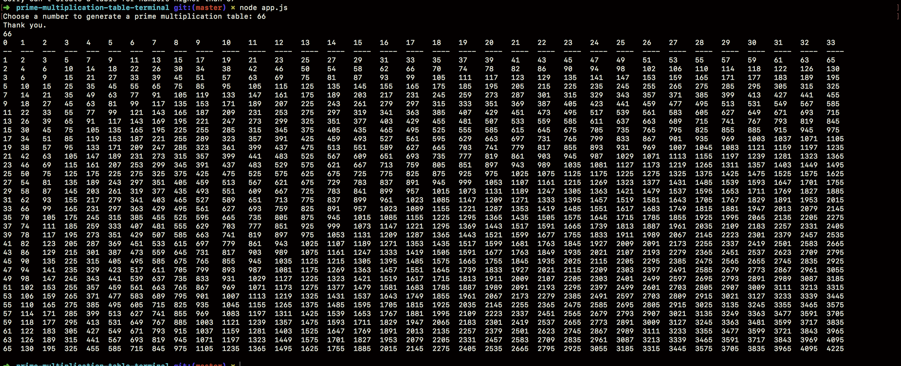

## How to run

- Clone this repo into your local machine.
```
git clone https://github.com/HuascarMC/prime-multiplication-table
```
- Go inside your prime-multiplication-table directory.
```
cd prime-multiplication-table-terminal
```
- Install all the packages required.
```
npm i
```
- Run all the tests and ensure they're all passing.
```
mocha tests
```
- Run the app using node.
```
node app.js
```
- The app will ask you for the required input, you should be able to get a prime multiplication table by typing a number 0 < 66 and pressing enter.



## Functionality

- The app displays a multiplication table of all the prime numbers requested by user. It uses a console.table package for the table format.

- Each component of the app has been unit tested using mocha, the tests are simple, clear and easy to understand.

- The app uses javascript's Readline() to handle user input, it informs the user of bad input and it doesn't crash using letters or symbols.


# Things to improve/currently working on.

- Only the components have been tested and not the app.

- The table displays a row of numbers on top, it's confusing. These numbers are not the index numbers of the table. This is caused by the 'console.table'.

- The app finishes after displaying one table instead of 'exiting' upon user request.

- A 'handle user input' component has been created but not used. Bad user input is being handle by if statement, this class could be used in the future when adding more functionality or prompting the user for more things.

- Different test cases could be added to some of the components.
